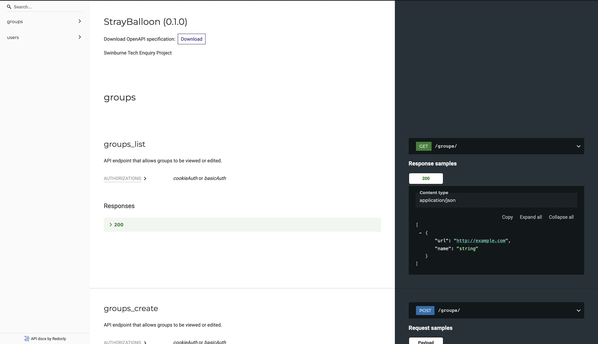

# Introduction

This is Group 1.1 Swinburne Tech Enquiry Project: Stray Balloon backend repository.
The app is written in Django with MongoDb for database.

# Getting Started

This project comes with [Poetry][1] for package management.
To start, [Poetry][1] is required, installation guide can be found here: https://python-poetry.org/docs/

```shell
    # 1. Set the app in a virtual environment:
    python -m venv .
    # 2. Enter the virtual environment:
    poetry shell
    # 3. Install dependencies:
    poetry install
    # 4. On the first time you run the app , run migrations:
    python manage.py migrate
    # 5. Run development server:
    python manage.py runserver
```

# Documentation

Once server is run, depending on your BASE_URL, API documentation can be found at endpoint `/schema/doc`. Example:
`http://localhost:8000/schema/redoc/`



[1]: https://python-poetry.org/
